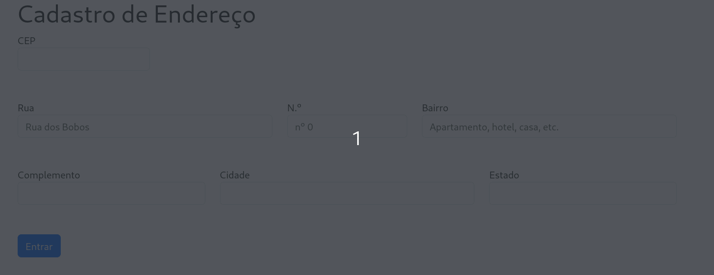
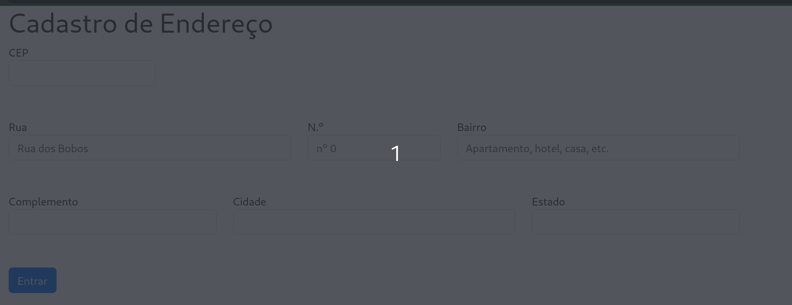

# Cadastro de Endereço

## Descrição

O projeto de formulário de cadastro de endereço consiste em demonstrar a utilização da linguagem JavaScript para consumo de API de endereço que está disponível no site [ViaCEP](https://viacep.com.br/).
Todas as instruções, incluíndo o código Javascript necessário para o funcionamento desse recurso está disponível no mesmo site.

## 🛠 Funcionalidades 

``Campos de cadastro``: Os campos de cadastro são relacionados aos dados de endereço somente. No entanto, são os mesmos campos solicitados em qualquer website de e-commerce, por exemplo.  
``Consumo de API ViaCEP``: Essa funcionalidade utiliza Javacript para consultar dados de endereço a partir do número de CEP informado.  
``Auto preenchimento``: A partir do CEP digitado no formulário, os campos **RUA**, **BAIRRO**, **CIDADE** e **ESTADO** são preenchidos automaticamente. Caso o CEP Informado está incorreto, o formulário apresenta uma mensagem de erro.

### Como funciona

``Consultando o CEP:`` A aplicação é simples. Consiste em o usuário digitar o CEP desejado. Ao mudar de campo, seja com o mouse, clicando em outro campo, seja pressionando a tecla TAB (utilizada para trocar de campo), o código Javascript é executado. 

``CEP inexistente:`` Ao digitar um CEP errado, o código irá disparar um método [alert](https://developer.mozilla.org/pt-BR/docs/Web/API/Window/alert) que irá mostrar uma caixa de diálogo com a mensagem de erro.

``CEP incorreto``: No caso de um CEP incorreto ou incompleto for digitado, ou mesmo se nada for digitado no campo, exibirá uma mensagem de CEP incorreto. **ATENÇÃO**: Para o caso de você não digitar nada, a mensagem só aparecerá se você clicar no campo destinado ao número de CEP.

## Tecnologias utilizadas

O projeto foi construído a partir de script disponível no site [ViaCEP](https://viacep.com.br/). No próprio site consta um exemplo para teste bem como o código necessário para seu funcionamento. Note que há duas opções: ``Javascript`` puro e ``JQuery``. 

## **ATENÇÃO:**

Para este projeto foi utilizada a versão do script do site ViaCEP de javascript puro. 
___

### Linguagens de marcação

``HTML5``  
``CSS3``  
``Markdown``  
 
### Linguagens de programação

``Javascript``

### Sistema de controle de versão

``Git``  
``Github``

### Framework

``Bootstrap``

#### Expressão regular

Foi utilizado no projeto uma [expressão regular](https://developer.mozilla.org/pt-BR/docs/Web/JavaScript/Guide/Regular_expressions). Esse recurso é muito utilizado em várias linguagens de programação. Neste caso, está coletando os números digitados pelo usuário entre 0 e 9. Esse processo exclui qualquer outro caracter que possa ser digitado. 

É possível entender melhor sobre expressões regulares neste [site](https://www.regexpal.com/) onde você pode testar e entender melhor como funciona. 

## 🔓 Acesso ao projeto

O projeto pode ser acessado por seu repositório no github. O código está disponível sob licença [GPL v3](https://github.com/leonardossrocha/projeto-CadEndereco/blob/master/LICENSE).

# Autores

| [ Leonardo Rocha](https://github.com/leonardossrocha) |  [ Leonardo Rocha (Marista)](https://github.com/leonardorochamarista)
| :---: | :---: |